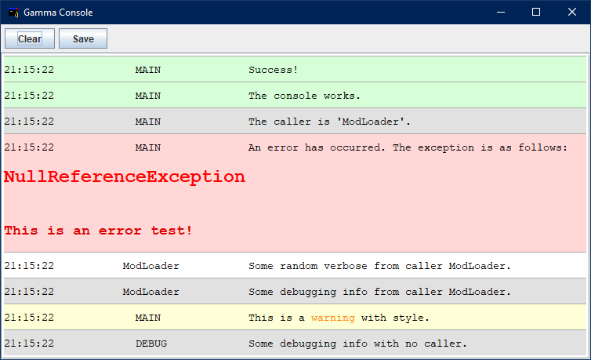

# About <a href="https://www.oracle.com/technetwork/java/javase/overview/java8-2100321.html"></a>

GammaConsole is an embeddable Java Swing logging console that supports HTML formatting.



# License <a href="https://github.com/UnexomWid/GammaConsole/blob/master/LICENSE"></a>

GammaConsole was created by [UnexomWid](https://uw.exom.dev). It is licensed under the [MIT](https://github.com/UnexomWid/GammaConsole/blob/master/LICENSE) license.

# Releases

>Note: versions with the suffix **R** are considered stable releases, while those with the suffix **D** are considered unstable.

None.

# Usage

```java
GammaConsole console = new GammaConsole();
//Modify the console using the modifiers (see below);
//You can only do this after constructing the object, and before calling the run() method.
console.run();

console.printInfo("GammaConsole works!");
console.printVerbose("Some verbose.");
console.printDebug("Some debugging info.");
console.printWarning("A warning.");
console.printError("An error");

console.printInfo("This info is called by Class1", "Class1");
console.printWarning("This warning is called by Class2", "Class2");
console.printError("This error is called by Class3", "Class3");
```

You can use HTML code inside the string arguments. Example:

```java
console.printError("<h1 style=\"color: red;\">This is bad</h1><br>Error details go below.");
```

You can change the title and icon of the console window like this:

```java
console.setTitle("New Title!");
console.setIconImage(new ImageIcon(icon_bytes).getImage());
```

# Modifiers

| Method / Field            | Description                                                                           |
|---------------------------|---------------------------------------------------------------------------------------|
| setBackgroundColor(Color) | Sets the background color of the console                                              |
| setTextColor(Color)       | Sets the console text color                                                           |
| setBorderColor(Color)     | Sets the color of the border between the lines                                        |
| setDebugColor(Color)      | Sets the color for Debug messages                                                     |
| setInfoColor(Color)       | Sets the color for Info messages                                                      | 
| setWarningColor(Color)    | Sets the color for Warning messages                                                   |
| setErrorColor(Color)      | Sets the color for Error messages                                                     |
| setTextSpacing(int)       | Sets the amount of spaces to write between the timestamp and the message              |
| fullTimestamp             | Whether to print the full timestamp for each log, or just the hour, minute and second |

Each `set` method has a `get` counterpart.

Example:

```java
GammaConsole console = new GammaConsole();
console.setBackgroundColor(new Color(128, 128, 128));
console.run();

console.printInfo("The console has a gray background!");
console.printDebug("Red amount in background color: " + console.getBackgroundColor.getRed());

```

# Other methods


| Method        | Description                                                                                             |
|---------------|---------------------------------------------------------------------------------------------------------|
| getLogCount() | Gets the amount of printed logs                                                                         |
| clear()       | Clears the console                                                                                      |
| save()        | Saves all the logs in a single HTML file *(named after the current timestamp)* in the working directory |

The console has 2 built-in buttons for `clear()` and `save()`.
